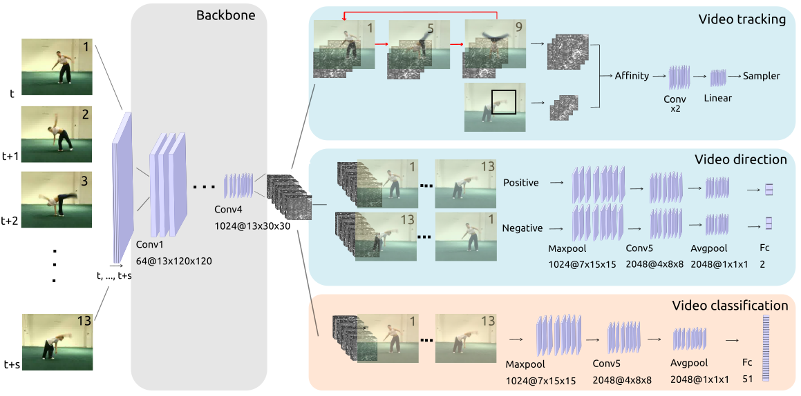
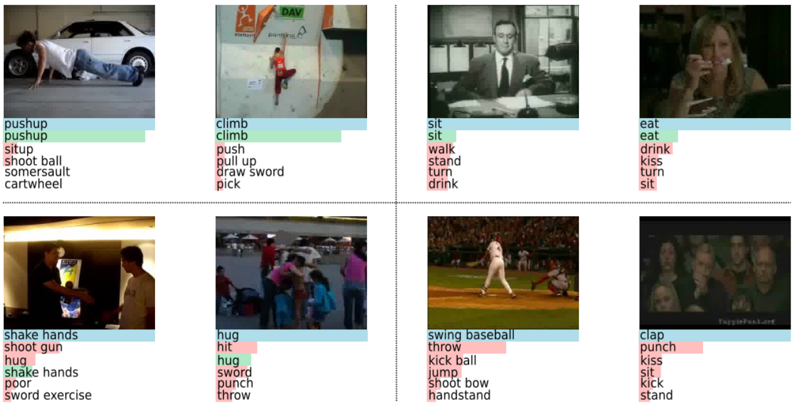

# Video Classification from scratch

This repository contains code for the project **Video Classification from scratch**, a project which aims to remove the dependency on pretraining in video classification by leveraging **self-supervised learning** to improve performance.

The project is a bachelor graduation project from June 2018: [Report](https://scripties.uba.uva.nl/download?fid=674765).

## Introduction

Every minute, 400 hours of video are uploaded to YouTube. Video being such a popular content type today has positively impacted the development of algorithms that attempt to extract semantic information from video, such as video classification. However, models often require initial model weights that are obtained by pretraining on large-scale datasets which is expensive and time-consuming.

Sequential data such as video contains a considerably larger amount of temporal information than images. This project researches whether it could be viable to remove the process of pretraining and train the network from scratch while combining additional utilization of spatiotemporal information.

The proposed architecture is a multi-branch architecture composed of three components: (1) video classification (2) video tracking task (3) video direction task. With methods (2) and (3), representations of the video are learned in a self-supervised manner
in which labels are automatically obtained. This model uses data more efficiently, as no other data or annotations are needed.

<p align="center">
  
</p>
<p align="center">
The proposed multi-branch network architecture consists of two self-supervised learning tasks.
</p>

The combined training of self-supervised learning and video classification is a novel approach that contributes to progress in both fields. Our model shows a significant improvement and favourable results on the HMDB-51 dataset in comparison with random initialization.


<p align="center">
  
</p>
<p align="center">
Predictions for several samples from the HMDB-51 dataset with ground truth label in blue, correct prediction in green and incorrect prediction in red.
</p>

## Instructions

### Preprocess
Follow [3D-ResNets-PyTorch](https://github.com/kenshohara/3D-ResNets-PyTorch) and change and run `utils/generate_filelist.py`

### Run
For example, this command can be used to train ResNet 50 model on split 1 of HMDB-51:

```
python3 main.py --timecycle_weight 25 --binary_class_weight 2 --annotation_path hmdb51_1.json --list hmdb_1.txt --result_path res50_bin_test --videoLen 3 --frame_gap 4 --predDistance 0 --gpu_id 0
```


--- 

### Acknowledgements
 
- 3D ResNets for Action Recognition: https://github.com/kenshohara/3D-ResNets-PyTorch
- TimeCycle: https://github.com/martinetoering/3D-ResNets-PyTorch-TimeCycle